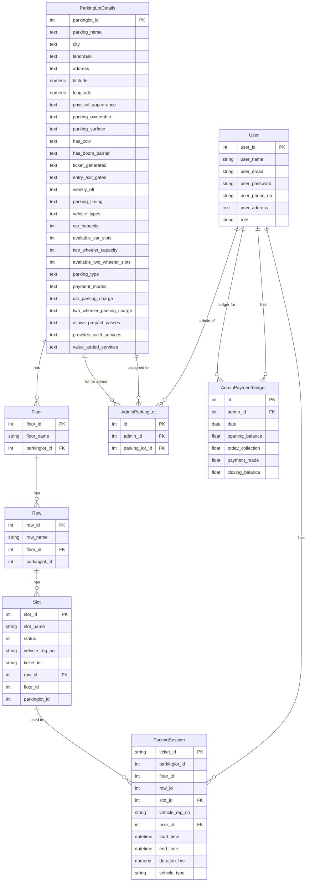

# Entity-Relationship Diagram (ERD)

> **Tip:** To view the ERD diagram below, use a Markdown preview extension that supports Mermaid diagrams (such as "Markdown Preview Mermaid Support" for VS Code, or enable Mermaid in your preferred Markdown viewer).

This diagram represents the relationships between tables in the Smart Parking backend database.

